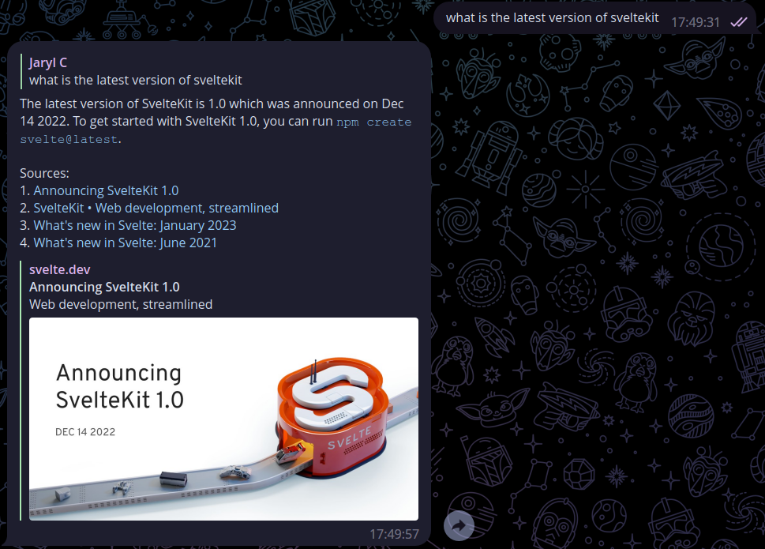

# cf-workers-bingai-sydney-telegram-bot


### Note: As of 23/05/2023, Bing seem to have restricted requests coming from Cloudflare Workers, I'm still investigating if there are workarounds.

## Description
 

Serverless Telegram bot in webhook mode to quickly interface with [BingAI a.k.a Sydney](https://www.bing.com/new)'s using a reversed engineered API.

This is much slower than ChatGPT variants as there is no way to disable streaming mode (words generate one at a time) and I have to capture when the stream ends.

This bot supports private chats, group chats and inline mode (tagging the bot in any chat with a query) with a confirmation button to make it smoother to use.

Notes:
- To clear Inline Mode context, tag the bot in chat without a query and tap on `Clear context and start a new conversation`
- Inline Mode is capped at a 64-character limit because of `callback_data` limits, but it can be solved by saving the query in KV if required
- This is mainly for personal use, if you would like to add features, do fork the repository. Do perform PRs back if you would be so kind!

## Prerequisites
- A Cloudflare account with Workers (at least free-tier) enabled
- The Telegram bot token of a bot created on Telegram via [@BotFather](https://t.me/BotFather)
- Logged in to Bing and grabbed the request cookie to https://edgeservices.bing.com/edgesvc/turing/conversation/create
    - Make sure a Success message is shown before grabbing the cookie
    - You can use your Browser's Developer Tools to extract this when visiting https://edgeservices.bing.com/edgesvc/turing/conversation/create
    - You likely need to periodically update this after it expires

## Getting Started
### Wrangler
1. Sign in to https://www.bing.com/ on the browser
2. Clone this repository
3. Run `npm ci` or `yarn install`
4. Run `npx wrangler secret put TELEGRAM_BOT_TOKEN` and set the Telegram bot token
5. Run `npx wrangler secret put BING_COOKIE` and set your latest Bing cookie request header on https://edgeservices.bing.com/edgesvc/turing/conversation/create
6. Add space-delimited case-sensitive usernames to whitelist in `TELEGRAM_USERNAME_WHITELIST` in wrangler.toml
7. (Optional) Choose your `BING_CONVERSATION_STYLE` by commenting and uncommenting accordingly in wrangler.toml
8. (Optional) Update `BING_BEHAVIOR` in wrangler.toml with your desired behavior / system message
9. (Optional) To enable context, run `npx wrangler kv:namespace create session` and replace the ID of `BINGAI_SYDNEY_TELEGRAM_BOT_KV` wrangler.toml, else remove `kv_namespaces` block entirely from wrangler.toml
10. Run `npx wrangler publish` to deploy to Cloudflare Workers
11. (Optional) Enable `Inline Mode` for the bot on BotFather to allow inline query flow
12. Replace `{TELEGRAM_BOT_TOKEN}` and `{WORKERS_NAMESPACE}` on the following `https://api.telegram.org/bot{TELEGRAM_BOT_TOKEN}/setWebhook?allowed_updates=%5B%22message%22%2C%22inline_query%22%2C%22callback_query%22%5D&url=https%3A%2F%2Fcf-workers-bingai-sydney-telegram-bot.{WORKERS_NAMESPACE}.workers.dev%2F{TELEGRAM_BOT_TOKEN}` and access it on your browser

### (On cookie expiry, roughly 2 weeks) Renewing BING_COOKIE
1. Sign in to https://www.bing.com/ on the browser
2. Run `npx wrangler secret put BING_COOKIE` and set your latest Bing cookie request header on https://edgeservices.bing.com/edgesvc/turing/conversation/create

## Other Optional Steps
### Bot Commands list
```
bingai - Triggers use of the bot in group chats without toggling Private Mode
sydney - Triggers use of the bot in group chats without toggling Private Mode
clear - Clear context for the current chat and start a new conversation
```
### Bot Inline Query Placeholder
```
Type your query and tap on Query BingAI above to submit
```
