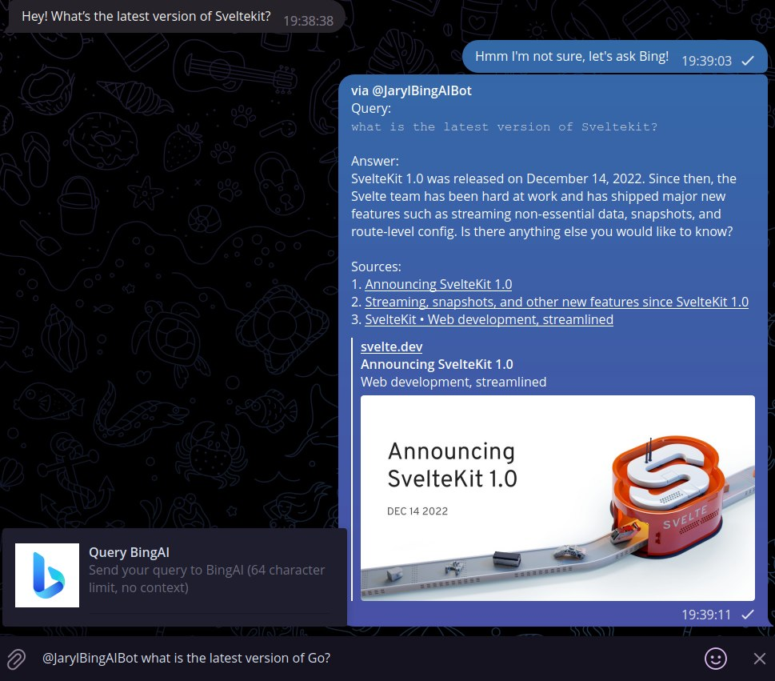

# cf-workers-bingai-sydney-telegram-bot


## Description
 

Serverless Telegram bot in webhook mode to quickly interface with [BingAI a.k.a Sydney](https://www.bing.com/new)'s using a reversed engineered API

Does not support contexts yet, planned for the future once I familiarize myself more with the API.

This is much slower than ChatGPT variants as there is no way to disable streaming mode (words generate one at a time) and I have to capture when the stream ends.

This bot supports private chats, group chats and inline mode (tagging the bot in any chat with a query) with a confirmation button to make it smoother to use.

Notes:
- Inline mode is capped at a 64-character limit because of `callback_data` limits, but it can be solved by saving the query in KV if required
- This is mainly for personal use, if you would like to add features, do fork the repository. Do perform PRs back if you would be so kind!

## Prerequisites
- A Cloudflare account with Workers (at least free-tier) enabled
- The Telegram bot token of a bot created on Telegram via [@BotFather](https://t.me/BotFather)
- A copy of the Cookie header when logged in to Bing and accessing https://edgeservices.bing.com/edgesvc/turing/conversation/create
    - You can use your Browser's Developer Tools to extract this 

## Getting Started
### Wrangler
1. Clone this repository
2. Run `npm ci` or `yarn install`
3. Run `npx wrangler secret put TELEGRAM_BOT_TOKEN` and set the Telegram bot token
4. Run `npx wrangler secret put BING_COOKIE` and set your latest Microsoft Cookie header
5. Add space-delimited case-sensitive usernames to whitelist in `TELEGRAM_USERNAME_WHITELIST` in wrangler.toml
6. Run `npx wrangler publish` to deploy to Cloudflare Workers
7. (Optional) Enable `Inline Mode` for the bot on BotFather to allow inline query flow
8. Replace `{TELEGRAM_BOT_TOKEN}` and `{WORKERS_NAMESPACE}` on the following `https://api.telegram.org/bot{TELEGRAM_BOT_TOKEN}/setWebhook?&allowed_updates=%5B%22message%22%2C%22inline_query%22%2C%22callback_query%22%5D&url=https%3A%2F%2Fcf-workers-bingai-syndey-telegram-bot.{WORKERS_NAMESPACE}.workers.dev%2F{TELEGRAM_BOT_TOKEN}` and access it on your browser

## Other Optional Steps
### Commands list (for BotFather as well)
```
bingai - Triggers use of the bot in group chats without toggling Private Mode
sydney - Triggers use of the bot in group chats without toggling Private Mode
clear - Clears any ForceReply messages
```
